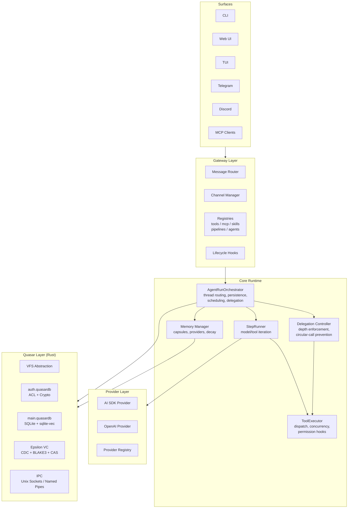
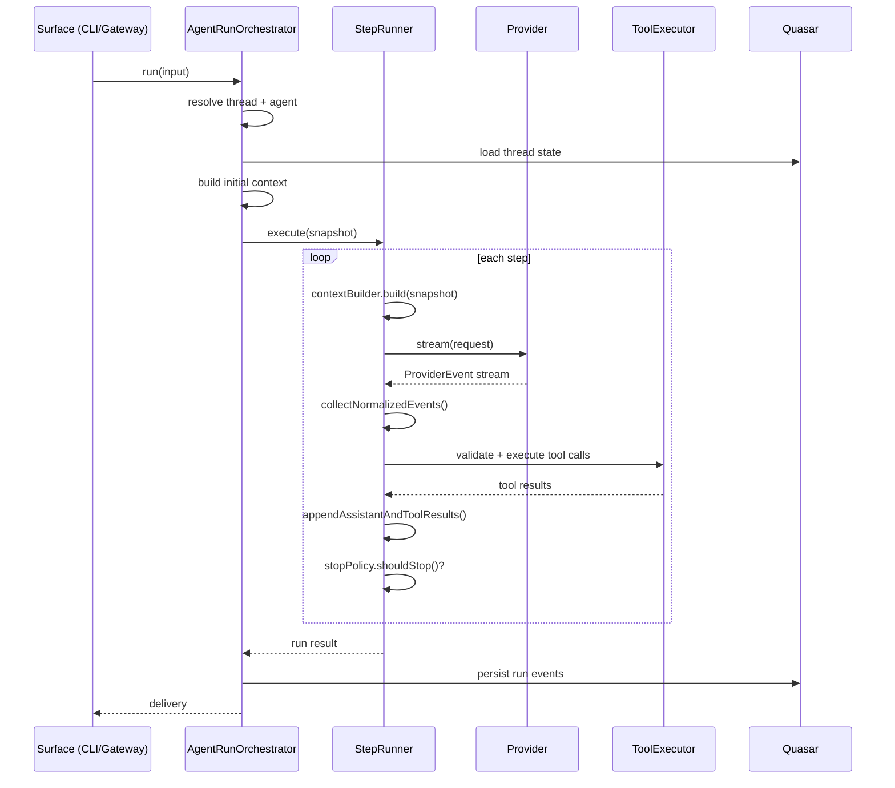
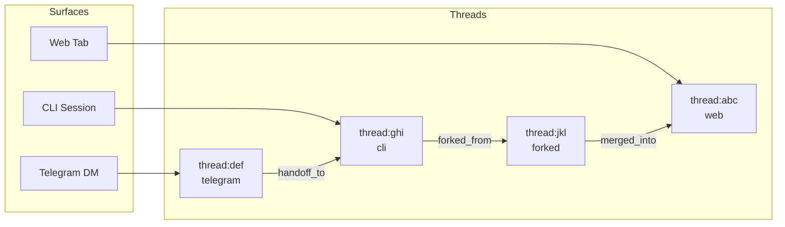
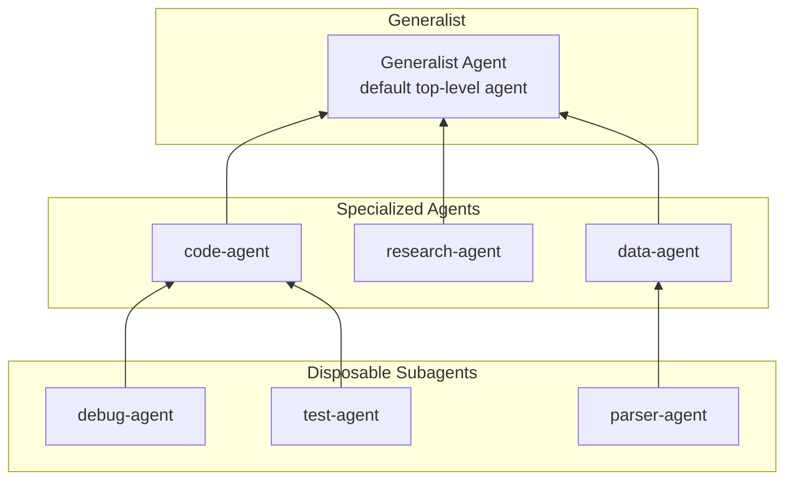
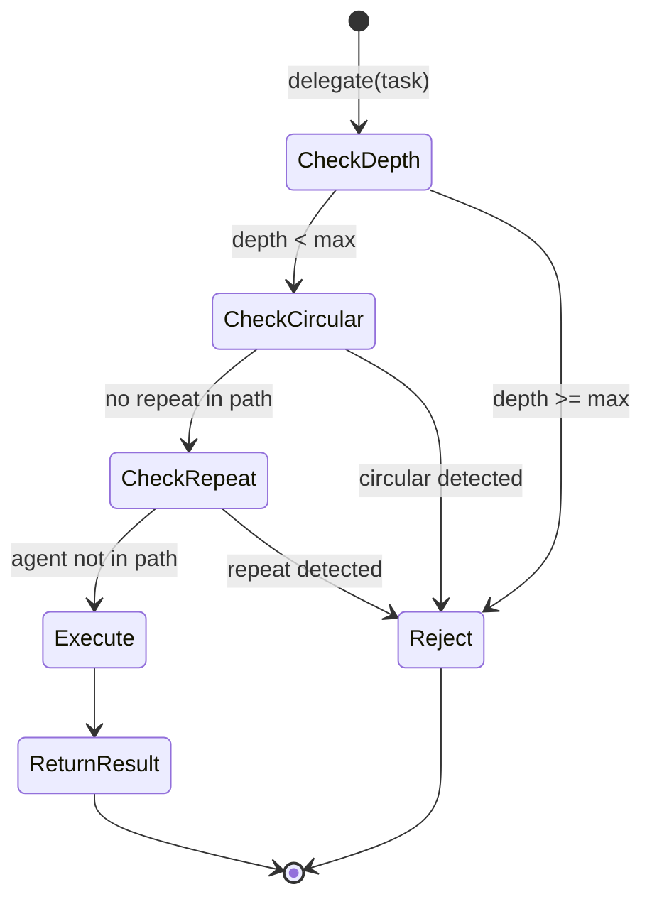
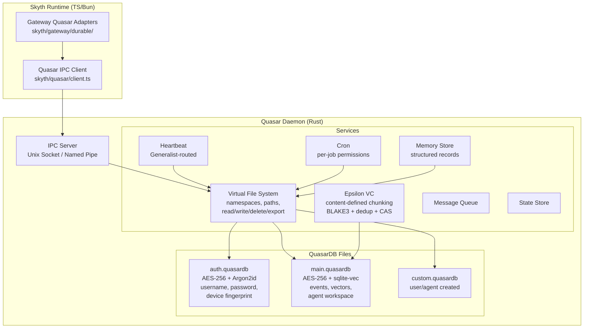
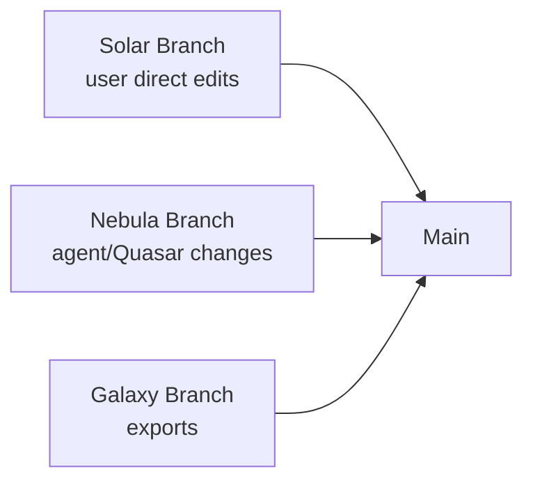
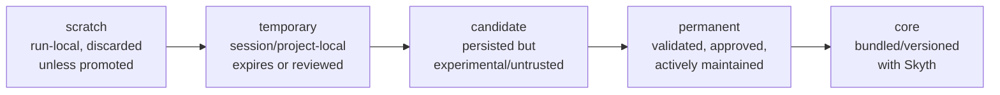

# Skyth

An agent runtime built with TypeScript/Bun and a Rust durability layer (Quasar).

Skyth synthesizes ideas from Claude Code, Codebuff, Hermes, Nanobot, OpenClaw,
OpenCode, Pi, and legacy Skyth TS into a single modular, registry-driven system.

## Architecture

### Language Stack

| Layer    | Language    | Responsibility                                                 |
| -------- | ----------- | -------------------------------------------------------------- |
| Runtime  | TypeScript  | Agent loop, gateway, MCP, registries, providers, CLI, tools    |
| State    | Rust        | Encrypted durable state, IPC, VFS, auth, memory, cron, Epsilon |
| Optional | Python      | Plugin/tool runtime only, not primary loop                     |

### Component Layers



## Core Runtime

### Two-Layer Agent Loop



**AgentRunOrchestrator** (outer layer) owns:
- Input normalization from CLI, gateway, channels, cron
- Thread lookup, routing, locking
- Quasar-backed run/step/message persistence
- Memory and context prefetch
- Compaction scheduling and retry
- Model selection and fallback
- Cancellation and interruption
- Heartbeat, cron, and resume scheduling
- Delegation depth and circular-call enforcement

**StepRunner** (inner layer) is harness-neutral:
```text
while not done:
  request = contextBuilder.build(snapshot)
  stream = provider.stream(request)
  step = collectNormalizedEvents(stream)
  checkedCalls = toolPolicy.validate(step.toolCalls)
  results = toolExecutor.execute(checkedCalls)
  appendAssistantAndToolResults(step, results)
  done = stopPolicy.shouldStop(step, results)
```

The StepRunner knows nothing about Telegram, HTTP, MCP transport,
Quasar internals, or channel-specific delivery.

## Threads

User-facing sessions are called **threads**. Every surface owns its own thread
graph.



Thread tools:
- `thread:read` -- load thread history
- `thread:search` -- search across threads
- `thread:handoff` -- continue in a new thread
- `thread:merge` -- merge two threads
- `thread:switch` -- switch active thread
- `thread:list` -- list threads for current surface
- `thread:compact` -- compact thread context

## Agent Hierarchy



Rules:
- Max delegation depth enforced centrally
- No circular delegation
- Subagents cannot delegate
- Subagents receive narrow tool sets
- Parent receives structured results

## Delegation Safety



## Quasar State Layer

Quasar is Skyth's encrypted durable state authority -- written in Rust.



### Epsilon Branch Taxonomy



Conflict resolution: no global winner. User edits create Solar branches,
agent changes create Nebula branches. The agent handles conflict resolution
during merge.

## Capability Lifecycle

Every created capability follows a lifecycle from ephemeral to permanent:



Promotion gates:
- Valid manifest and `.ax` sidecar
- Declared permissions and security model
- Duplicate and conflict check
- Successful smoke test or explicit waiver
- Usage or user approval signal
- No secret leakage
- Audit event written

## Registry Auto-Discovery

All extensible capabilities register via manifest JSON:

```json
{
  "id": "my-tool",
  "name": "My Tool",
  "version": "1.0.0",
  "entrypoint": "./index.ts",
  "capabilities": ["tool:execute"],
  "dependencies": [],
  "security": {
    "permissions": ["filesystem:read"]
  }
}
```

Registry domains: providers, channels, tools, agents, skills, plugins, MCP,
pipelines.

Fail-open policy: a broken external plugin must not block internal discovery.

## Project Structure

```
skyth/              TypeScript/Bun source tree
  agents/           Concrete agent definitions
  api/              API routes
  base/             Base agent runtime (orchestrator, step-runner, tools,
                    delegation, session, context, memory, manifests, plugins)
  cli/              CLI commands and onboarding wizard
  config/           Config loading, schema validation, secret store
  core/             Core compatibility exports
  cron/             Cron service wrapper
  gateway/          Gateway server, channels, MCP, registries, runners,
                    hooks, lifecycle, memory stores
  providers/        Provider adapters (AI SDK, OpenAI, registry)
  quasar/           TypeScript IPC client, protocol, daemon lifecycle
  utils/            Shared utilities, templates
quasar/             Rust crate (auth, crypto, Epsilon, IPC, services, VFS)
specs/              Architecture specifications and handoffs
  core/             Core runtime specs (hybrid-agent-loop)
  quasar/           Quasar specs (quasar-v1)
  progress/         Current progress tracking
  handoffs/         Agent handoff documents
tests/              Test suite (132+ tests)
```

## Quick Start

```bash
# Install dependencies
bun install

# Build CLI binary
bun run build:bin

# Run typecheck
bun run typecheck

# Run tests
bun test tests/

# Start CLI
bun run start --help

# Start gateway server
bun run gateway
```

## Project Status

Active development. See [specs/progress/Progress.md](specs/progress/Progress.md)
for current status and next steps.

Architecture decisions are documented in:
- [Skyth Next Runtime and Capability System](specs/skyth-next-runtime-and-capabilities.md)
- [Hybrid Agent Loop](specs/core/hybrid-agent-loop.md)
- [Quasar v1 Specification](specs/quasar/quasar-v1.md)

Contributor policies are in [CONTRIBUTING.md](CONTRIBUTING.md).

## License

MIT. See [LICENSE](LICENSE).
